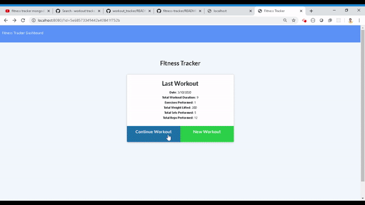

[](http://hits.dwyl.com/Amitabh-K/fitness-tracker)
<br />
<p align="center">

  <h3 align="center">Workout Tracker</h3>

  <p align="center">
  App allows for the user to track workouts. User has the capability to add either cardio or resistance training to a mongo database. The user input is stored by day. Each exercises stats are display in a dashboard to show the previous 7 days of workouts.
    The user can create, view, and track daily workouts. They can log multiple exercises for a workout on a given day. They can also view stats and see progress bars.
    <br />
    <a href="https://github.com/Amitabh-K/fitness-tracker"><strong>Explore the docs »</strong></a>
    <br />
    <br />
    <a href="https://fitness-track-amitabh.herokuapp.com/">Explore the Deployed App</a>
  </p>
</p>


## Usage demo




## Table of Contents

* [About the Project](#about-the-project)
  * [Built With](#built-with)
* [Getting Started](#getting-started)
  * [Prerequisites](#prerequisites)
  * [Installation](#installation)
* [Contact](#contact)
* [Acknowledgements](#acknowledgements)


## About The Project

[![Product Name Screen Shot][product-screenshot]]()


### Built With

* [Bootstrap](https://getbootstrap.com/)
* [jQuery](https://jquery.com/)
* [MongoDB](https://www.mongodb.com/)


<!-- GETTING STARTED -->
## Getting Started

To get a local copy up and running follow these simple steps.

### Prerequisites

This is an example of how to list things you need to use the software and how to install them.
* npm
```sh
npm install npm@latest -g
```

### Installation
 
1. Clone the repo
```sh
git clone https://github.com/Amitabh-K/fitness-tracker
```
2. Install NPM packages
```sh
npm install
```


Project Link: [https://fitness-track-amitabh.herokuapp.com/](https://fitness-track-amitabh.herokuapp.com/)


## Acknowledgements

* [Mongoose.js](https://mongoosejs.com/)
* [Mongo DB](https://www.mongodb.com/)
* [UofTBootCamp](https://bootcamp.learn.utoronto.ca/coding/?utm_source=pardot&utm_campaign=cln_coding_new_em8&utm_medium=email&utm_term=cta-btn)
